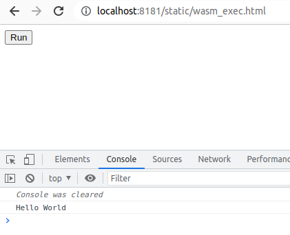
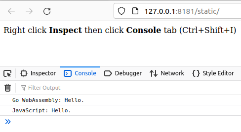
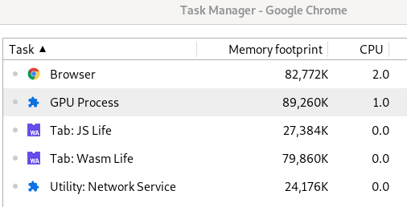

# Wasmup: Go C Rust WebAssembly

Try it online: [WebAssembly is here.](https://wasmup.github.io/WebAssembly/)

[Rust WebAssembly Quick start](https://github.com/wasmup/WebAssembly/tree/master/102hello-rs)  

[Go WebAssembly Quick start](https://github.com/wasmup/WebAssembly/tree/master/100)







---

## Static file server

### Static file server in Rust: Install the latest from GitHub

```sh
# RUSTFLAGS='-C link-arg=-s' 
cd rsserve
cargo install 
# cargo install --git https://github.com/wasmup/rsserve.git
# Finished release [optimized] target(s) in 5m 14s
file $(which rsserve)
```
### Static file server in Go: Run

```sh
go get -ldflags=-s -u github.com/shurcooL/goexec
goexec 'http.ListenAndServe(`:8080`, http.FileServer(http.Dir(`.`)))'
```

### Static file server in Go: Install

```sh
go get -ldflags=-s -u github.com/shurcooL/goexec
goexec 'http.ListenAndServe(`:8080`, http.FileServer(http.Dir(`.`)))'

echo $GOBIN
echo $GOPATH
cd ginserve
go get
go build -ldflags=-s -o $GOBIN/ginserve
which ginserve
file $(which ginserve)
```

### Static file server in Python3: Run

```sh
./pyserve.py
```

---

## Tools

Linux:
```sh
# Install Rust:
curl https://sh.rustup.rs -sSf | sh
# Then add some components:
rustup component add rustfmt rust-src rust-analysis rls 
# Install targets for Rust
rustup target add wasm32-unknown-unknown
rustup target add wasm32-wasi

# https://github.com/bytecodealliance/wasmtime/blob/master/docs/WASI-tutorial.md
curl https://wasmtime.dev/install.sh -sSf | bash

# https://github.com/WebAssembly/wabt
# curl -OL https://github.com/WebAssembly/wabt/archive/1.0.13.tar.gz 
curl -OL https://github.com/WebAssembly/wabt/releases/download/1.0.13/wabt-1.0.13-linux.tar.gz
tar -C ~/ -xzvf ./wabt-1.0.13-linux.tar.gz
~/wabt-1.0.13/wasm2wat --version
# 1.0.13

# https://github.com/alexcrichton/wasm-gc
RUSTFLAGS='-C link-arg=-s' cargo install wasm-gc --force
# wasm-gc v0.1.6
file $(which wasm-gc)
wasm-gc -h

# https://github.com/rustwasm/wasm-bindgen
RUSTFLAGS='-C link-arg=-s' cargo install wasm-bindgen-cli --force
file $(which wasm-bindgen)
wasm-bindgen --version
# wasm-bindgen 0.2.58
```

---

### Why WebAssembly

WebAssembly is fast, safe, portable, and part of the open Web platform.  
Using the advantage of strongly typed languages like Go, Rust, ... (compiler can detect many errors at compile time)
Portable target for compilation of high-level languages  
Available on a wide range of platforms including mobile and IoT (not just x86)  
Efficient and fast (near-native performance, precompiled: relative to JavaScript)  
Size-efficient and load-time-efficient binary format  
Memory-safe  
Sandboxed execution environment  
Non-web embeddings  
Accessible from JavaScript, integrate well with the existing Web platform  
Integrating with the Web ecosystem  
Leveraging Web APIs  
Supporting the Web’s security model  
Preserving the Web’s portability  
Designing in room for evolutionary development

---

See also:  
[Go WebAssembly](https://github.com/golang/go/wiki/WebAssembly)  

[WebAssembly JavaScript Interface](https://webassembly.github.io/spec/js-api/index.html)  
[Understanding the JS API](https://webassembly.org/getting-started/js-api/)  
[Roadmap](https://webassembly.org/roadmap/)  
[yew: Rust / Wasm framework for building client web apps](https://github.com/yewstack/yew)  
[yew-wasm-pack-template: A template for starting a Yew project to be used with wasm-pack](https://github.com/yewstack/yew-wasm-pack-template)  
[wasm-bindgen: Facilitating high-level interactions between Wasm modules and JavaScript](https://github.com/rustwasm/wasm-bindgen)  
[wasm-bindgen docs](https://rustwasm.github.io/docs/wasm-bindgen/)  
[Standalone JIT-style runtime for WebAssembly](https://github.com/bytecodealliance/wasmtime)  
[WASI tutorial](https://github.com/bytecodealliance/wasmtime/blob/master/docs/WASI-tutorial.md)  
[WASI: WebAssembly System Interface](https://github.com/bytecodealliance/wasmtime/blob/master/docs/WASI-overview.md)  
[WASI - The WebAssembly System Interface](https://wasi.dev/)  
[WebAssembly Runtime supporting WASI](https://github.com/wasmerio/wasmer)

[Design Rationale](https://webassembly.org/docs/rationale/)  
[WebAssembly High-Level Goals](https://webassembly.org/docs/high-level-goals/)  
[webassembly.org](https://webassembly.org/)  
[webassembly.studio](https://webassembly.studio/)  
[WebAssembly Specifications](https://webassembly.github.io/spec/)  
[WebAssembly Reference Manual](https://github.com/sunfishcode/wasm-reference-manual/blob/master/WebAssembly.md)  
[developer.mozilla](https://developer.mozilla.org/en-US/docs/WebAssembly)  
[awesome-wasm](https://github.com/mbasso/awesome-wasm)  
[Rust and WebAssembly](https://rustwasm.github.io/)  
[Features to add after the MVP](https://github.com/WebAssembly/design/blob/master/FutureFeatures.md)  
[GitHub](https://github.com/WebAssembly)  
[C to Webassembly](https://dassur.ma/things/c-to-webassembly/)  
[Notes on working with C and WebAssembly](https://aransentin.github.io/cwasm/)  
[WebAssembly lld port](https://lld.llvm.org/WebAssembly.html)  
[WASM in Rust without NodeJS](https://dev.to/dandyvica/wasm-in-rust-without-nodejs-2e0c)
